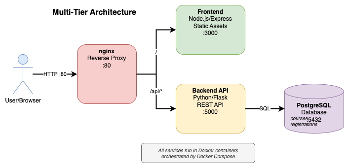
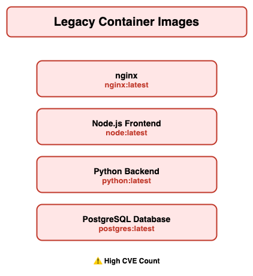
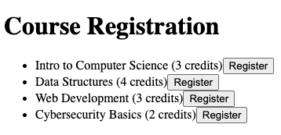
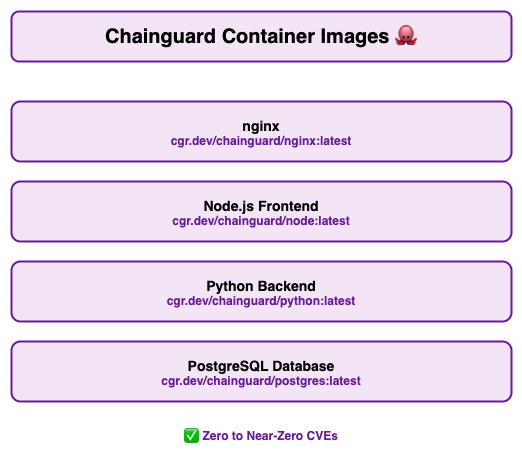

# cyber-bay-sample-app

<div align="center">
  
  <p><em>Scan to access this repository!</em></p>
</div>

---

This is a sample web application showcasing a multi-tier architecture using **Node.js**, **Python (Flask)**, **PostgreSQL**, and **nginx**.

We will walk through and build this app two different ways and then use a Python script with grype to compare the two deployments:
- **Legacy version** with traditional upstream container images.
- **Chainguard version** using minimal, secure-by-default, zero to near-zero CVE container images.

## Architecture

<div align="center">
  
</div>

---

## Getting Started

### Prerequisites
- Terminal access
- [Docker](https://www.docker.com/) (container runtime)
- [Docker Compose](https://docs.docker.com/compose/) (multi-container build and orchestration)
- [grype](https://github.com/anchore/grype) (for scanning container images)
- Python 3.7+ (for vulnerability reporting)
- Clone this directory and `cd` into it from your terminal: 
```bash
git clone https://github.com/troy-chainguard-dev/cyber-bay-sample-app.git && cd cyber-bay-sample-app
```

### Python Virtual Environment Setup

Create and activate a Python virtual environment for the scanning tools:

```
python3 -m venv venv
```
For Mac/Linux, activate the virtual environment:
```
source venv/bin/activate
```

For Windows:
```
venv\Scripts\activate
```
Install Python dependencies:
```
pip install -r scanners/requirements.txt
```

**Note:** The environment will need to be activated to run the scanners in later steps so we can work within the virtual Python environment for the remainder of the steps 

---

## 1. Build and Run the Legacy Version

### Container Images Used

<table>
<tr>
<td width="45%">
  
</td>
<td width="55%" valign="top">
  <br/>
  <h4>🔗 Upstream Docker Images:</h4>
  <ul>
    <li><strong>nginx:</strong> <a href="https://hub.docker.com/_/nginx">docker.io/library/nginx:latest</a></li>
    <li><strong>Node.js:</strong> <a href="https://hub.docker.com/_/node">docker.io/library/node:latest</a></li>
    <li><strong>Python:</strong> <a href="https://hub.docker.com/_/python">docker.io/library/python:latest</a></li>
    <li><strong>PostgreSQL:</strong> <a href="https://hub.docker.com/_/postgres">docker.io/library/postgres:latest</a></li>
  </ul>
</td>
</tr>
</table>

First we will use docker compose to build the app using the legacy images. The following `docker compose` command will recognize the `docker-compose.yaml` file in the root project directory and build our project using public upstream images from Docker Hub for each specific component.  **Note that the --build flag will force Docker to rebuild each container which involves pulling new images.  This may take a long time on a poor network connection!**

```bash
docker compose up -d --build
```

Expected output:
```
[+] Running 8/8
 ✔ backend Built                           0.0s
 ✔ frontend Built                          0.0s
 ✔ nginx Built                             0.0s
 ✔ Network cyber-bay-sample-app_default    0.1s
 ✔ Container legacy-postgres Started       0.3s
 ✔ Container legacy-backend Started        0.3s
 ✔ Container legacy-frontend Started       0.3s
 ✔ Container legacy-nginx Started          0.3s
```

### Verify It's Running

To ensure the containers are running:
```bash
docker ps
```

Expected output:
```
CONTAINER ID   IMAGE                       STATUS         PORTS                    NAMES
9da02e3b2f76   cyber-bay-nginx:latest      Up 3 minutes   0.0.0.0:80->80/tcp       legacy-nginx
26e1462fabb0   cyber-bay-frontend:latest   Up 3 minutes                            legacy-frontend
3cc427943561   cyber-bay-backend:latest    Up 3 minutes   0.0.0.0:5000->5000/tcp   legacy-backend
22f51e9cdff9   postgres:latest             Up 3 minutes   0.0.0.0:5432->5432/tcp   legacy-postgres
```

Open [http://localhost:80](http://localhost:80) in your browser to view the website:

<div align="center">
  
</div>

Check that the backend API works:

```bash
curl http://localhost:5000
```

You should see the response: `Hooray! The API works.`

### Scan Legacy Images for CVEs

Now let's scan our running containers for security vulnerabilities:

Activate your virtual environment if you haven't already (macOS/Linux):
```bash
source venv/bin/activate
```

Run the scanner:
```bash
python3 scanners/scan-and-report.py
```

This single command will:
- ✅ Detect all running containers from `docker compose`
- ✅ Use Grype to scan each container image for known CVEs
- ✅ Generate CSV reports with vulnerability data
- ✅ Auto-generate formatted Excel reports with charts and formatting

**Output files in `./scanners/scan-results/`:**
- `grype-legacy-images.csv` - Raw vulnerability data
- `grype-legacy-images.xlsx` - Formatted Excel report with:
  - Executive summary with statistics and pie charts
  - Color-coded severity levels (Critical=Red, High=Orange, etc.)
  - Hyperlinked CVE IDs (click to view details on NIST NVD)
  - Separate worksheets for each severity level
  - Per-image breakdown sheets (including images with 0 vulnerabilities)
  - Auto-filtering and sortable columns

---

## 2. Tear Down the Legacy Stack

To clean everything, including volumes:

```bash
docker compose down -v
```

---

## 3. Build and Run the Chainguard Version

### Container Images Used

<table>
<tr>
<td width="45%">
  
</td>
<td width="55%" valign="top">
  <br/>
  <h4>🐙 Chainguard Images:</h4>
  <ul>
    <li><strong>nginx:</strong> <a href="https://images.chainguard.dev/directory/image/nginx/overview">cgr.dev/chainguard/nginx:latest</a></li>
    <li><strong>Node.js:</strong> <a href="https://images.chainguard.dev/directory/image/node/overview">cgr.dev/chainguard/node:latest</a></li>
    <li><strong>Python:</strong> <a href="https://images.chainguard.dev/directory/image/python/overview">cgr.dev/chainguard/python:latest</a></li>
    <li><strong>PostgreSQL:</strong> <a href="https://images.chainguard.dev/directory/image/postgres/overview">cgr.dev/chainguard/postgres:latest</a></li>
  </ul>
  <p><em>✅ Zero to near-zero CVEs • Minimal attack surface</em></p>
</td>
</tr>
</table>

We will now use Docker Compose to create our Chainguard version of the app by pointing to a specific compose file called `docker-compose-chainguard.yaml`  This compose file will reference the specific `cgr.dev/chainguard/<images>` listed above

```bash
docker compose -f docker-compose-chainguard.yaml up -d --build
```

Expected output:
```
[+] Running 8/8
 ✔ backend Built                           0.0s
 ✔ frontend Built                          0.0s
 ✔ nginx Built                             0.0s
 ✔ Network cyber-bay-sample-app_default    0.1s
 ✔ Container cg-postgres Started           0.3s
 ✔ Container cg-backend Started            0.4s
 ✔ Container cg-frontend Started           0.4s
 ✔ Container cg-nginx Started              0.4s
```

### Verify It's Running

To ensure the Chainguard-based containers are running (notice the **cg** tags on container names):
```bash
docker ps
```

Expected output:
```
CONTAINER ID   IMAGE                                STATUS         PORTS                    NAMES
476abfd23815   cyber-bay-nginx-cg:latest            Up 5 minutes   0.0.0.0:80->80/tcp       cg-nginx
4a12bab4e30b   cyber-bay-frontend-cg:latest         Up 5 minutes                            cg-frontend
5151ef168869   cyber-bay-backend-cg:latest          Up 5 minutes   0.0.0.0:5000->5000/tcp   cg-backend
949fdcf98c9d   cgr.dev/chainguard/postgres:latest   Up 5 minutes   0.0.0.0:5432->5432/tcp   cg-postgres
```

Open [http://localhost:80](http://localhost:80) in your browser.

Check the API:

```bash
curl http://localhost:5000/
```

### Scan Chainguard Images for CVEs

Now let's scan the Chainguard images for security vulnerabilities:

```bash
python3 scanners/scan-and-report.py
```

This will generate the same reports as above (CSV and Excel), plus an additional **comparison report** that shows:
- 📊 Executive summary with reduction metrics and % improvements
- 📈 Visual comparison of vulnerability distributions
- 💡 Key takeaways highlighting security wins

### Image Comparison: Legacy vs Chainguard

Here's a snapshot comparison from a recent scan on 10/6/25 (your results may vary based on scan date):

| Component | Legacy Image | Size | CVEs | Chainguard Image | Size | CVEs |
|-----------|-------------|------|------|------------------|------|------|
| **nginx** | `nginx:latest` | ~187 MB | 150+ | `cgr.dev/chainguard/nginx:latest` | ~50 MB | 0-2 |
| **Frontend** | `node:latest` | ~1.1 GB | 200+ | `cgr.dev/chainguard/node:latest` | ~75 MB | 0-2 |
| **Backend** | `python:latest` | ~1.0 GB | 180+ | `cgr.dev/chainguard/python:latest` | ~50 MB | 0-1 |
| **Database** | `postgres:latest` | ~420 MB | 120+ | `cgr.dev/chainguard/postgres:latest` | ~280 MB | 0-1 |
| **TOTAL** | | **~2.7 GB** | **650+** | | **~455 MB** | **0-6** |

**Key Takeaways:**
- 🔻 **83% reduction in total image size** (2.7 GB → 455 MB)
- 🔻 **99% reduction in CVEs** (650+ → 0-6)
- ⚡ **Faster deployments** - Less data to pull and scan
- 🛡️ **Smaller attack surface** - Fewer components means fewer vulnerabilities

---

## 4. Tear Down the Chainguard Stack

To clean everything, including volumes:

```bash
docker compose down -v
```

---

## Migrating From Upstream to Chainguard

One of the key benefits of Chainguard images is how straightforward it is to migrate from upstream images. Let's walk through the Python backend as an example to see what's involved.

### Legacy Dockerfile (Upstream Python)

```dockerfile
FROM python:latest

WORKDIR /app
COPY . .
RUN pip install --no-cache-dir -r requirements.txt

CMD ["python", "wsgi.py"]
```

**Issues with this approach:**
- ❌ Large image size (~1GB+) with full OS packages
- ❌ Build tools remain in final image
- ❌ High CVE count from unnecessary dependencies
- ❌ Runs as root by default

### Chainguard Dockerfile (Hardened Python)

```dockerfile
FROM cgr.dev/chainguard/python:latest-dev AS builder

WORKDIR /app

COPY requirements.txt .

RUN python -m venv /app/venv && \ 
    /app/venv/bin/pip install --no-cache-dir -r requirements.txt

FROM cgr.dev/chainguard/python:latest

WORKDIR /app

ENV PYTHONUNBUFFERED=1
ENV PATH="/venv/bin:$PATH"

COPY . .
COPY --from=builder /app/venv /venv

ENTRYPOINT [ "python", "wsgi.py" ]
```

**Benefits of this approach:**
- ✅ Minimal image size (~50MB) with only runtime dependencies
- ✅ Multi-stage build separates build tools from runtime
- ✅ Zero to near-zero CVEs
- ✅ Runs as non-root user by default
- ✅ Uses virtual environment for dependency isolation

### Key Migration Steps

1. **Use multi-stage builds** - Separate build environment (`-dev` image) from runtime
2. **Implement virtual environments** - Chainguard's minimal images require proper dependency isolation
3. **Copy only what's needed** - Use `COPY --from=builder` to get only the venv
4. **Update base image references** - Change `python:latest` to `cgr.dev/chainguard/python:latest`

This pattern applies to most language migrations - build in one stage with tools, run in a minimal stage with only runtime dependencies.

---

## Wrap Up: How Chainguard Achieves Zero to Near-Zero CVEs

### The Chainguard Approach

Chainguard achieves dramatically lower CVE counts through several key principles:

**1. Minimalism by Design**
- Only essential runtime components included
- No package managers, shells, or build tools in final images
- Smaller image = smaller attack surface

**2. Distroless Architecture**
- No traditional Linux distribution (no apt, yum, etc.)
- Only application and its runtime dependencies
- Eliminates vulnerabilities from unused system packages

**3. Proactive Security**
- Daily automated rebuilds with latest patches
- Continuous vulnerability scanning and remediation
- CVEs fixed before they're widely disclosed

**4. Software Bill of Materials (SBOM)**
- Every image includes a cryptographically signed SBOM
- Complete transparency of what's in your containers
- Easy compliance and audit trails

**5. Non-Root by Default**
- All images run as non-privileged users
- Reduces blast radius of potential exploits
- Follows principle of least privilege

### Key Benefits Summary

| Benefit | Impact |
|---------|--------|
| 🛡️ **Security** | 99% reduction in CVEs compared to upstream images |
| 📦 **Size** | 80-90% smaller images mean faster deployments |
| ⚡ **Performance** | Less to scan, pull, and start = better CI/CD times |
| 🔒 **Compliance** | Built-in SBOMs simplify auditing and governance |
| 🔄 **Maintenance** | Daily updates ensure you're always patched |
| 💰 **Cost** | Reduced storage, bandwidth, and security incident costs |

### Why It Matters

In production environments, every CVE represents:
- Potential security incidents requiring investigation
- Compliance violations and audit findings
- Emergency patching and deployment cycles
- Risk to your customers and reputation

**Chainguard Images eliminate these concerns** by providing secure-by-default containers that are continuously maintained, minimally scoped, and transparently documented.

---